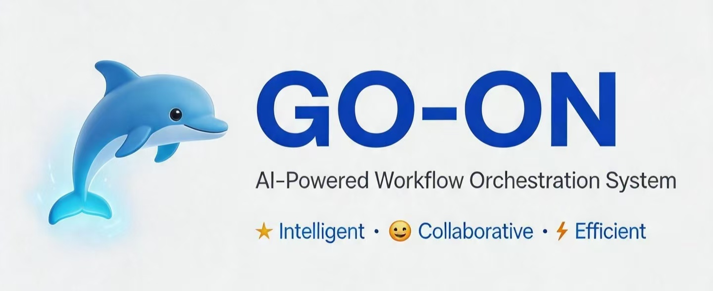
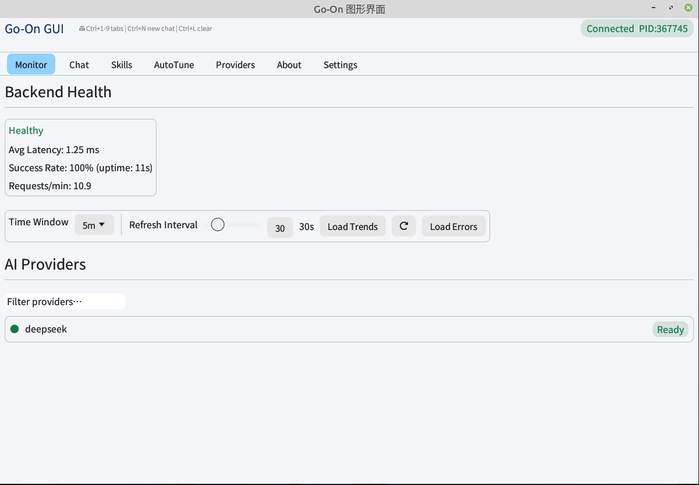
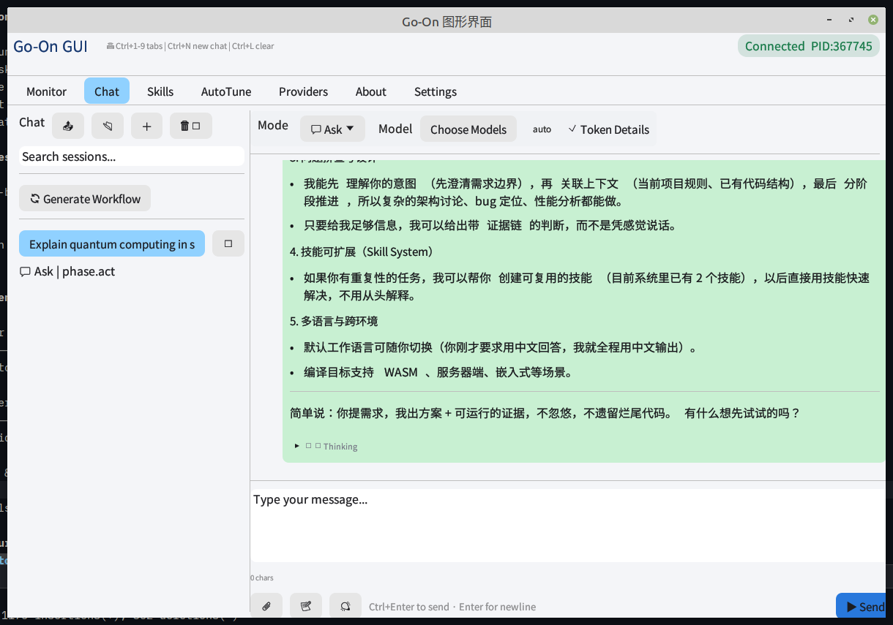
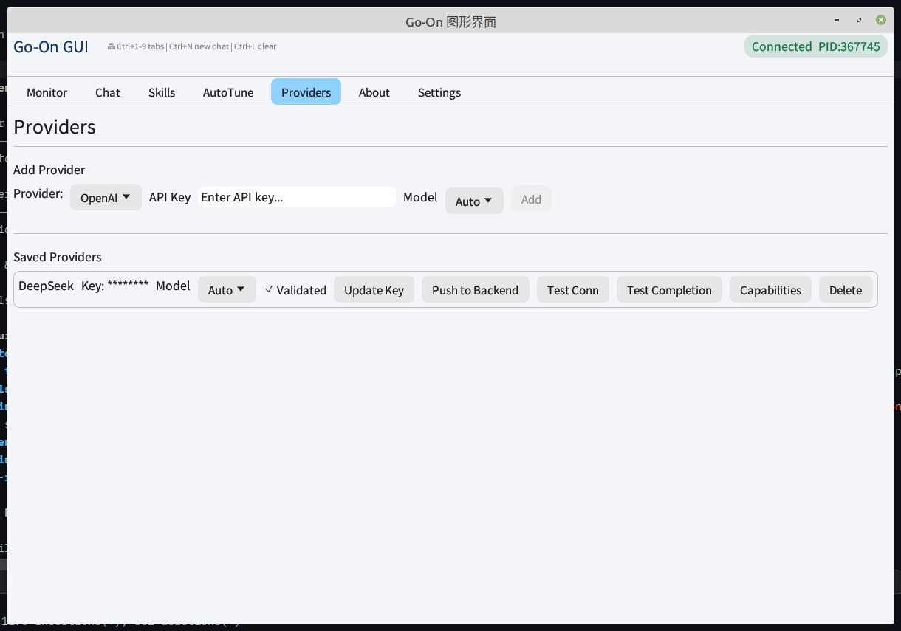
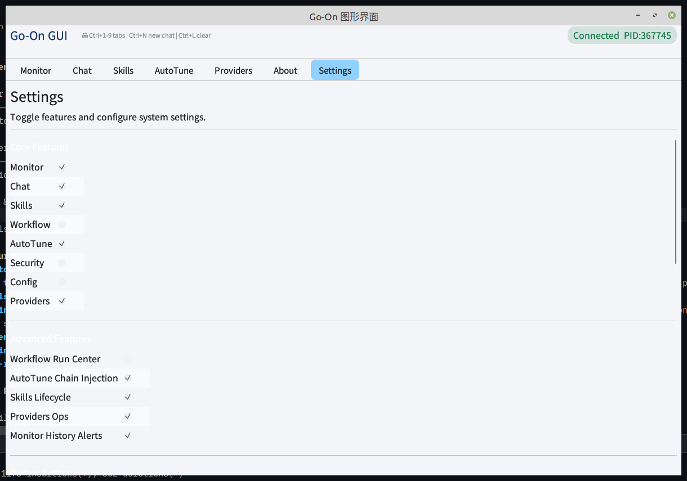
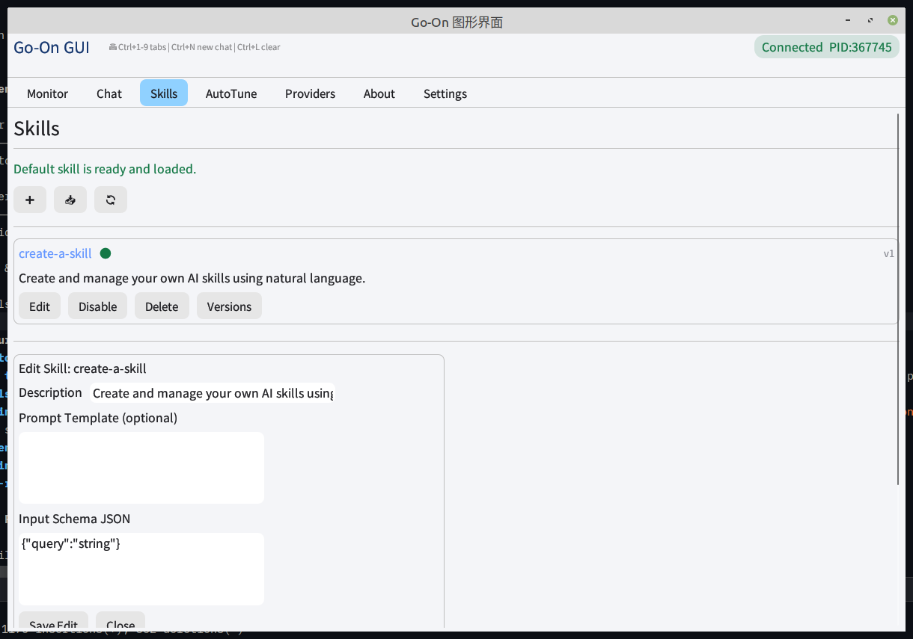

<p align="center">
  
</p>

<p align="center">
  <strong>go-on</strong> — A Rust-based AI agent orchestration runtime with desktop GUI, VS Code extension, SSE streaming, MCP/ACP protocols, autonomous workflows, and built-in governance. v1.5.0
</p>

<p align="center">
  English | <a href="README.zh-CN.md">简体中文</a>
</p>

<p align="center">
  <em>AI agent orchestration · multi-model routing · autonomous workflows · governance & safety · zero clippy warnings</em>
</p>

---

[](https://www.rust-lang.org)
[](LICENSE)
[](https://github.com/mikewolfli/go-on/actions/workflows/build.yml)
[]()
[]()
[]()
[]()
[]()

## What is go-on?

go-on is a **local-first**, production-grade **AI agent orchestration runtime** written in Rust. It bridges large language models with your tools, files, and workflows through SSE streaming, standard agent protocols (ACP / MCP), and a cognitive loop architecture. You can run it as a CLI, a desktop GUI app, or a backend server — with autonomous loops, DAG tool orchestration, sub-agent panels, and built-in governance.

**Use go-on to:**
- 🖥️ Chat with AI models via a native desktop GUI (EGUI) or terminal
- 🤖 Run autonomous agents that plan, execute, reflect, and self-correct
- 🧩 Choose from **5 chat modes**: Ask, Plan, Edit, SafeGuard, FullAuto
- 🔧 Orchestrate multi-tool workflows with dependency-aware DAG execution
- 🔌 Connect AI models to MCP servers or act as an MCP server yourself
- 🛡️ Enforce governance policies with RBAC, audit trails, and risk assessment
- 📊 Monitor sub-agent executions and command outputs in real-time via SSE panels
- 🧩 Extend via VS Code extension, Skill Marketplace (33 skills), or Rust/Python/TypeScript SDK

## Quick Start

```bash
# Build and run (creates default config automatically)
cargo run

# Open the desktop GUI
cargo run --manifest-path gui/Cargo.toml

# Terminal chat mode
cargo run -- --chat

# Start as MCP server
cargo run -- --protocol-mode mcp_stdio
```

First run opens an interactive setup wizard if no AI providers are configured.

**Full documentation**: see the `cookbook/` directory (mdBook format with trilingual support) — `cd cookbook && mdbook serve --open`

**[Contributing guide](CONTRIBUTING.md)** — commit conventions, PR workflow, and development setup.

Default health endpoint: `http://127.0.0.1:8090/health`

---

## Screenshots

| Monitor Dashboard | Chat Interface |
|:---:|:---:|
|  |  |

| Provider Management | Settings |
|:---:|:---:|
|  |  |

| Skills & Tools |
|:---:|
|  |

---

## Features

### Agent Orchestration
- **5 chat modes** — Ask (streaming conversation), Plan (outline-only), Edit (iterative with high-risk guards), SafeGuard (risk-scored auto-degradation), FullAuto (memory+diff+verification)
- **Autonomous agent loop** — Plan → Execute → Reflect → Replan, with complexity-adaptive iteration
- **Sub-agent monitoring** — Real-time SSE panels for sub-agent execution and command output in the GUI
- **DAG task execution** — Kahn topological sort, dependency edges, parallel group execution, cycle detection
- **Full-auto flow** — Parse intent → discover skills → prepare environment → execute → report
- **Fast path cache** — SHA-256 fingerprint, TTL/LRU eviction, 4-tier caching (intent/skill/env/route)
- **Multi-model voter** — Concurrent agent voting for high-stakes decisions (majority/weighted/unanimous/fusion)

### AI Provider Support (37)
OpenAI · Anthropic · DeepSeek · Gemini · xAI Grok · Groq · Mistral · Qwen · Llama · Copilot · SiliconFlow · Cohere · AI21 · Perplexity · Together · Fireworks · Replicate · MiniMax · Moonshot · Zhipu GLM · Baidu Qianfan · ByteDance Doubao · Tencent Hunyuan · StepFun · Skywork · Yi · Kimi · NIM · Aleph Alpha · DeepQuest · FaceWall · LoopAI · Langboat · Titan · Wenxin · Xihu

Native function calling is supported for OpenAI, Anthropic, DeepSeek, Gemini, Groq, and xAI Grok.

### Protocols & Transport
- **ACP** (Agent Client Protocol) — stdio + HTTP, JSON-RPC 2.0
- **MCP** (Model Context Protocol) — stdio + HTTP, tool list/call, streaming, cancellation, timeout
- **5 transport modes**: `adaptive` (dual-stack), `acp_stdio`, `acp_http`, `mcp_stdio`, `mcp_http`
- **SSE streaming protocol** — chunk, done, telemetry, error, state_sync, sub_agent, command + Responses API events
- **Cross-entry parity** — consistent stop_reason and round count across ACP/CLI/MCP

### Tool System
- **60+ built-in tools** — read/write/search/apply_patch/run_tests/inspect_git_diff/shell_exec/http_request/grep/find/git/cargo_check/cargo_test/list_directory/file_move/file_delete/compress/decompress/date_time/dns_lookup/ping/port_scan/skill_list/skill_execute + CAD/3D/GIS/barcode/SVG/office/image processing + document parsers (PDF/DOCX/PPT/HTML/Markdown/Excel)
- **Tool pipeline** — serial/parallel/conditional execution with error handling
- **Tool transactions** — idempotency keys, WAL persistence, compensation actions
- **Dynamic tool recommendation** — pattern + recency + co-occurrence based suggestions
- **Mode-based tool restrictions** — allowed_tools and max_tool_calls enforced per mode

### Governance & Safety
- **HarnessBus** — central governance with policy evaluation, drift detection, security checks
- **PUA rules engine** — real-time policy evaluation with escalation levels
- **RBAC** — role-based access control with tenant registration
- **Tenant isolation** — cross-tenant blocking; budget-aware concurrency limits
- **Audit trail** — full decision pipeline recording with replay capability
- **Audit integrity** — every audit entry hash-chain verified for tamper detection (`governance.audit.verify` + optional Ed25519 signing)
- **Prompt injection detection** — runtime scanning for injection patterns with configurable threshold
- **Content safety checking** — SafeGuard mode for AI-powered risk assessment

### Performance
- **Fast sub-second startup** — Reduced redundant SQLite initialization; HTTP server binds port in seconds
- **FastPathCache** — sub-millisecond cache lookup for repeated queries
- **SSE buffer pool** — zero-allocation streaming event serialization
- **Cache warming** — predictive pre-warming with adaptive TTL
- **DAG Join timeout** — prevents single slow tool from stalling the pipeline

### Resilience
- **Recovery orchestrator** — 6 strategies: Retry → Reroute → Replan → Repair → Escalate → Degrade
- **Chaos testing** — 10 fault injection types (timeout, partition, crash, corruption, rate-limit)
- **HyperResilience** — circuit breaker state machine, failover groups, self-healing
- **Hot failover** — primary-to-fallback model switching with blacklist cooldown

### Observability
- **Prometheus `/metrics` endpoint** — 16+ metrics including latency, throughput, cache hit rates
- **OpenTelemetry tracing** — OTLP/stdout export, spans for routing, execution, selection
- **Governance status endpoint** — real-time p95 latency, DAG metrics, cache stats
- **Audit replay** — full task execution evidence chain, filterable

### Session Management
- **Session context** — key concept extraction, message importance scoring, continuity markers
- **Session compression** — semantic compression of overflow messages
- **Context window budget** — intelligent message retention within token limits

### Security
- **Request signing** — Ed25519 or HMAC-SHA256 for JSON-RPC request authentication
- **mTLS** — mutual TLS for ACP HTTP listener with cert-pinning and expiry monitoring
- **Secret rotation** — HashiCorp Vault integration for key lifecycle management
- **System keyring** — macOS Keychain, Linux Secret Service, Windows Credential Manager
- **Content safety** — runtime content scanning with configurable policies

### Configuration & Deployment
- **Hot-reload config** — file-watch based, atomic swap at runtime
- **Schema versioning** — semver-tracked config with migration
- **4 build profiles** — local (SQLite), simple-server (SQLite), multi-users-server (PostgreSQL + pgvector), full (all features)
- **Docker** — production containers with HEALTHCHECK, k8s manifests available
- **OTel** — distributed tracing via OTLP collector (default: `localhost:4317`)
- **Trilingual i18n** — English, Simplified Chinese, Traditional Chinese (~95% coverage across backend, GUI, VS Code)

### Skill Marketplace (33 skills)
- **Marketplace catalog**: 33 built-in skill entries — code-reviewer, commit-message-generator, refactoring-advisor, test-generator, api-docs-generator, changelog-generator, ci-pipeline-generator, context-summarizer, data-transformer, decision-logger, dependency-analyzer, dockerfile-generator, error-recovery-planner, knowledge-retriever, log-analyzer, progress-tracker, prompt-optimizer, regex-builder, self-reviewer, skill-creator, sql-query-helper, task-planner, web-scraper, code-execution-sandbox, project-analyzer, api-tester, semantic-diff, note-taking, classify-text, summarize-text, translate-text, review-pr, embed-text + more
- **Import from GitHub/URL/local** — SkillImportStore fetches and validates SKILL.md manifests
- **Auto-discovery** — `~/.agents/skills/` directory scanned on startup

---

## Architecture

go-on uses a **sub-bus capability architecture** — 7 feature-gated sub-buses (tool, orchestration, observability, optimization, memory, protocol, distributed-memory) — with a cognitive loop and a unified **DispatchOutput** handler pattern:

```
┌────────────────────────────────────────────────────────────┐
│                    HarnessBus (Governance)                  │
│  Policy · Drift Detection · Resilience · Security · Audit  │
├────────────────────────────────────────────────────────────┤
│               CapabilityBus (Intelligence)                  │
│  Sense → Decide → Act → Feedback → Evolve                 │
├──────────┬──────────┬──────────┬──────────┬───────────────┤
│ ToolBus  │ ObservB. │ MemoryBus│ ProtocolB.│ OrchestB.    │
├──────────┼──────────┼──────────┼──────────┼───────────────┤
│ Unified  │ Reinforc.│ Learning │ Capab.   │ DistMemB.    │
│ Knowl.B. │ ementBus │ OptimB.  │ Graph    │              │
├────────────────────────────────────────────────────────────┤
│              CommunicationBus (Agent Tree)                  │
│  AgentPath · AgentMessenger · ContextForker                │
└────────────────────────────────────────────────────────────┘

> Sub-bus feature gates are defined in `Cargo.toml`: `sub-bus-tool`,
> `sub-bus-orchestration`, `sub-bus-observability`, `sub-bus-optimization`,
> `sub-bus-memory`, `sub-bus-protocol`, and `sub-bus-distributed-memory`.
> The `local` profile enables six sub-buses (tool, orchestration,
> observability, optimization, memory, protocol); `simple-server` and
> `multi-users-server` additionally enable distributed-memory (all seven).
> The diagram groups these into the capability modules above.
```

### Request Handler Dispatch

All 148 JSON-RPC handlers return a unified `DispatchOutput` enum. The dispatch layer serializes each variant to the appropriate transport response:

```
Handler → Result<DispatchOutput> → dispatch_to_client → JSON-RPC / SSE / text/plain
  ├─ Json(Value)          → standard JSON-RPC success
  ├─ Error { code, msg }  → JSON-RPC error with precise error code
  ├─ Stream { receiver }  → channel-based streaming (chat)
  │    ├─ "chunk"     → JSON-RPC notification chat.stream.chunk
  │    ├─ "done"      → JSON-RPC notification chat.stream.done
  │    ├─ "telemetry" → JSON-RPC notification chat.stream.telemetry
  │    ├─ "result"    → JSON-RPC result (final response)
  │    └─ "error"     → JSON-RPC error
  ├─ Text(String)        → JSON-RPC with __text_plain__ sentinel
  ├─ Checkpoint(...)     → auto-decomposed checkpoint success/error
  └─ Silent              → no response (JSON-RPC notification)
```

### Chat Execution Pipeline (SSE)

```
GUI/CLI → POST /chat/stream → Backend
  │ observe_phase → think_phase → act_phase → reflect_phase
  │   ├─ emit_stream_chunk()     → SSE event: chunk
  │   ├─ emit_stream_sub_agent() → SSE event: sub_agent
  │   ├─ emit_stream_command()   → SSE event: command
  │   ├─ emit_stream_token_economy() → SSE event: telemetry
  │   └─ emit_stream_done()      → SSE event: done
  ▼
Client SSE parser → PendingResponse → UI panels
  ├─ StreamChunk   → message content update
  ├─ SubAgentEvent → Sub-agents panel (collapsible)
  ├─ CommandOutput → Commands panel (collapsible)
  └─ TokenEconomy  → token count display
```

### Key Capability Modules

| Module | Description |
|:-------|:------------|
| **HarnessBus** | Central policy engine: evaluate/validate/verify, PUA rules, RBAC, drift detection, hyper-resilience, audit trail |
| **CapabilityBus** | Multi-factor agent selection (reputation + task-fit + outcome) with causal Bayesian graph for routing |
| **CommunicationBus** | Hierarchical agent tree, inter-agent messaging, cancellation propagation, context forking (BLUE70) |
| **UnifiedKnowledgeBus** | Consolidated knowledge + reputation + experience management with EMA scoring (BLUE70) |
| **ReinforcementBus** | Q-Learning + optional federated RL for routing optimization (BLUE70) |
| **LearningOptimizationBus** | Atomic learn-and-optimize: execution events → optimization suggestions (BLUE70) |
| **Planner** | Task-adaptive DAG planning with dependency inference |
| **BrainLoop** | Plan → Execute → Reflect → Replan cognitive cycle |
| **DAG Driver** | Topological execution with parallel group scheduling |
| **SelfModelCore** | System self-awareness and capability tracking |
| **MetacognitiveController** | Observation-driven reflection and corrective action |
| **WorldModel** | Entity/event/relationship tracking with causal insight |
| **HyperResilience** | Circuit breaker, failover group, self-healing |
| **MultiChannelTransport** | QoS-aware, prioritized message transport |

---

## Extensions

### VS Code Addon
`vscode-addon/` contains a VS Code extension that launches go-on and exposes 60+ commands — chat, workflow execution, skill management — inside the editor.

```bash
cd vscode-addon
npm install
npm run compile
```

### SDKs
- **Rust SDK** (`sdk/rust/`) — Strongly typed client with methods across multiple domains
- **Python SDK** (`sdk/python/`) — HTTPX-based async client with streaming support
- **TypeScript SDK** (`sdk/typescript/`) — Full TypeScript client for browser and Node.js environments (also consumed by `vscode-addon`)

### Zed Editor Integration
`.zed/settings.json` pre-registers go-on as a Zed agent server (`agent_servers.go-on`) with auto-approve enabled, plus `auto_approve_tools` for common read-only operations (file reads, directory listings, and searches).

---

## Codebase Statistics

| Metric | Value |
|:-------|:------|
| Rust backend LOC | ~206K (451 modules) |
| GUI (EGUI) LOC | ~24K |
| VS Code addon (TypeScript) LOC | ~17K |
| SDK (Rust + Python + Node.js + TypeScript) LOC | ~4K |
| Built-in tools | 60+ |
| AI providers | 37 |
| Skills in marketplace | 33 |
| Unit tests | ~3.5K (see Verification below) |
| Trilingual i18n | en / zh-CN / zh-TW (~95% coverage) |

## Build Profiles

| Profile | Backend | Use Case |
|:--------|:--------|:---------|
| `local` | SQLite + sqlite-vec | Single-user local tool (default) |
| `simple-server` | SQLite + sqlite-vec | Single-server deployment |
| `multi-users-server` | PostgreSQL + pgvector | Multi-user production |
| `full` | SQLite (all features) | CI / development |

```bash
# Build commands
cargo build                                                    # local (default)
cargo build --no-default-features --features simple-server
cargo build --no-default-features --features multi-users-server
cargo build --no-default-features --features full
```

## Verification

| Profile | `cargo clippy -D warnings` | Test Status |
|:--------|:--------------------------:|:-----------:|
| `local` | ✅ **Zero warnings** | ✅ **all pass** |
| `simple-server` | ✅ **Zero warnings** | ✅ **all pass** |
| `multi-users-server` | ✅ **Zero warnings** | ✅ **all pass** |
| `full` | ✅ **Zero warnings** | ✅ **all pass** |

All 4 build profiles compile with zero clippy warnings. The latest full `cargo test --all-targets` run passes every suite with zero failures (see the latest section of `CHANGELOG.md` for the current counts). The GUI and VS Code addon also compile cleanly with zero errors.

---

## License

MIT License — see [LICENSE](LICENSE) for details.
