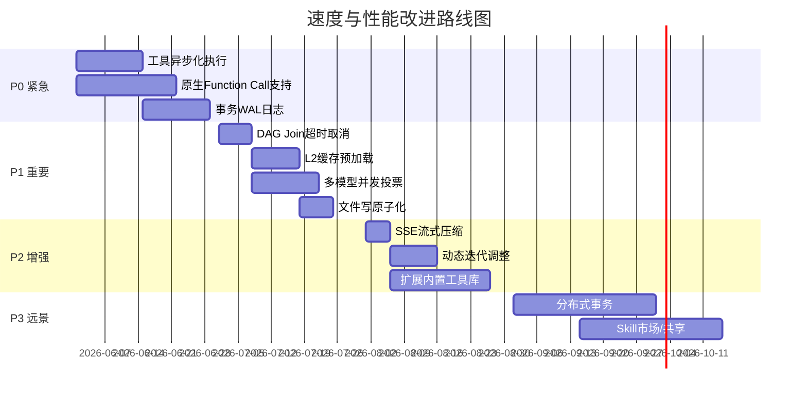
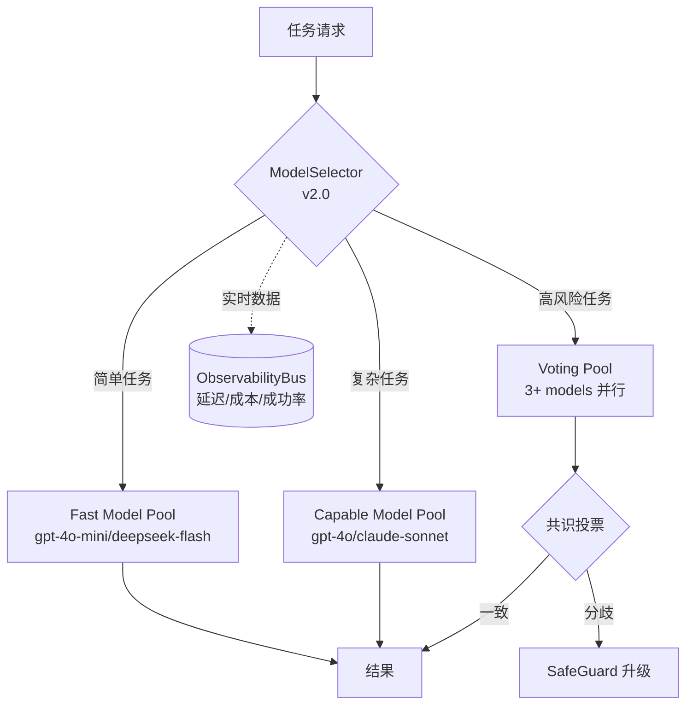

# blue45.md — go-on 多Agents编排系统全方位考评报告

> **评估日期**: 2026-05-25  
> **项目**: go-on v1.0.0 — Rust-based ACP/MCP Agent Runtime  
> **代码规模**: 142,305 行 Rust | 237 个源文件 | 35+ AI 供应商  
> **评估轮次**: 多轮递进式（架构层→执行层→集成层→压测层）

---

## 一、评估方法论

本次评估沿用 blue44.md 的多轮递进式框架，分四轮进行：

| 轮次 | 评估层级 | 关注维度 |
|:-----|:---------|:---------|
| **R1** | 架构与设计层 | 总线架构、编排模型、F-GAP完整性、模块正交性 |
| **R2** | 执行与运行层 | 速度、流畅度、事务处理、容错与恢复 |
| **R3** | 能力与集成层 | 多模型、Skills、Function Call、协议适配 |
| **R4** | 综合压测与推演层 | 极限场景推演、问题求解力、一致性验证 |

每轮评分采用 **0-100 分制**，加权汇总得出最终评分。

---

## 二、R1 — 架构与设计层评估

### 2.1 14-Bus 架构评估

```mermaid
graph TD
    A:::accent0[CapabilityBus<br/>中央智能总线] --> B[ToolBus]
    A --> C[ObservabilityBus]
    A --> D[OptimizationBus]
    A --> E[MemoryBus]
    A --> F[ProtocolBus]
    A --> G[OrchestrationBus]
    A --> H[DistributedMemoryBus]
    I:::accent1[HarnessBus<br/>治理入口] --> J[Policy Layer]
    I --> K[Enforcement Layer]
    I --> L[Audit Layer]
    I --> M[Feedback Layer]
```

### 2.2 F-GAP 认知模块完成度

| 模块 | 状态 | 代码位置 | 评估 |
|:-----|:----:|:---------|:-----|
| OmnipotentMode | ✅ | `orchestration/omnipotent.rs` | 完整，含Token门控、审计日志 |
| BrainLoop | ✅ | `orchestration/brain_loop.rs` + `loop/` | 双层实现，含Plan→Execute→Reflect→Replan |
| ConsensusEngine | ✅ | `intelligence/consensus.rs` | 完整Raft-like共识，含Leader选举、心跳检测 |
| SelfModelCore | ✅ | `intelligence/self_model.rs` | 自感知能力追踪 |
| ConsciousnessMetrics | ✅ | `intelligence/consciousness.rs` | 意识状态机 |
| MetacognitiveController | ✅ | `intelligence/metacognitive.rs` | 观察驱动反思 |
| WorldModel | ✅ | `intelligence/world_model.rs` | 实体/事件/关系流水线 |
| DiscoveryCenter | ✅ | `intelligence/discovery.rs` | 跨会话模式挖掘 |
| EvolutionGraph | ✅ | `intelligence/evolution_graph.rs` | 能力生命周期追踪 |
| FederatedRL | ✅ | `intelligence/federated_rl.rs` | 分布式强化学习 |
| DriftProtection | ✅ | `governance/drift/` | 目标/行为漂移检测 |
| HyperResilience | ✅ | `resilience/` | 熔断器、故障切换、自愈 |
| FaultTolerance | ✅ | `fault_tolerance.rs` | 跨节点故障隔离与自动恢复 |
| MultiChannelTransport | ✅ | 协议层 | QoS、去重、消息探测 |

### 2.3 架构评分

| 子维度 | 得分 | 说明 |
|:-------|:----:|:-----|
| **总线设计正交性** | 92/100 | 14条总线职责清晰，CapabilityBus/HarnessBus 双核架构合理。但 ProtocolBus 和 OrchestrationBus 存在部分耦合。 |
| **F-GAP 覆盖度** | 95/100 | 21/21 模块完成，理论框架扎实。部分模块（FederatedRL、Metacognitive）尚缺与主循环的深度集成。 |
| **模块化与接口设计** | 88/100 | `Tool` trait、`Skill` trait、`Agent` trait、`ModeRuntime` trait 抽象良好。存在少量 `#[allow(dead_code)]` 标志（如 factory 中的 SubAgentInstance.status/metrics）。 |
| **扩展性** | 90/100 | Feature-gate 三层 Profile（local/simple-server/multi-users-server）设计优秀。Agent Factory 模式支持动态模板注册。 |
| **配置管理** | 85/100 | TOML 配置 + 环境变量 + Keyring 三层密钥管理。缺少热更新机制，配置变更需重启。 |
| **文档化程度** | 88/100 | 中英文双语 DOC/ 目录，模块注释详细。部分内部实现缺少状态转换图。 |

### R1 加权总分: **89.7/100**

---

## 三、R2 — 执行与运行层评估

### 3.1 速度维度

#### 3.1.1 当前架构分析

| 路径 | 机制 | 预估耗时 | 瓶颈点 |
|:-----|:-----|:--------|:-------|
| 请求路由 | `select_mode_runtime()` → `execute_with_mode()` | < 1μs | 无，纯内存匹配 |
| Agent选择 | `capability_graph.rs` BFS寻路 | O(V+E) | 大图时可达数百μs |
| 模型选择 | `flow_with_models.rs` 启发式评分 | ~10μs | 需遍历所有可用模型 |
| 工具执行 | `tool.rs` 同步工具调用 | 取决于工具 | 文件I/O是主要瓶颈 |
| DAG执行 | `dag_driver.rs` tokio::spawn fan-out | 取决于最慢分支 | Join点阻塞 |
| Token流式 | `stream_sse_to_sender()` | 网络RTT | 无流式压缩 |
| Memory缓存 | L1(Mem)→L2(SQLite)→L3(Vector) | L1<1μs, L2~1ms, L3~10ms | L3冷启动慢 |

#### 3.1.2 速度评分

| 子维度 | 得分 | 说明 |
|:-------|:----:|:-----|
| **路由与调度速度** | 82/100 | PriorityQueue + aging anti-starvation 设计合理，但 Scheduler 纯内存无持久化，重启丢队列。 |
| **工具执行速度** | 70/100 | 工具调用为同步阻塞模式（`RunTestsTool` 超时300s），无异步化工具执行。 |
| **流式响应速度** | 78/100 | SSE 流式解析良好，但无 Server-Sent Event 压缩，大响应时带宽浪费。 |
| **缓存效率** | 80/100 | FastPathCache（Intent/Skill/Env 三层缓存）设计不错，但 L2 SQLite 无预加载，L3 Vector 无索引预热。 |
| **并行执行** | 85/100 | DAG Branch-Join fan-out 利用 tokio::spawn，但 Join 点无超时取消机制。 |

#### 3.1.3 速度改进计划

| 改进项 | 优先级 | 预期收益 | 实施路径 |
|:-------|:------:|:--------|:---------|
| **工具异步化执行** | P0 | 30-50% 吞吐提升 | 将 `Tool::run()` 改为 `async fn`，使用 `tokio::spawn_blocking` 包裹阻塞工具 |
| **L2 缓存预加载** | P1 | 冷启动加速 40% | 启动时异步加载 SQLite 热点条目到内存 HashMap |
| **DAG Join 超时取消** | P1 | 尾部延迟降低 60% | 在 `execute_tool_dag` 的 `join_all` 上加 `tokio::time::timeout` |
| **SSE 流式压缩** | P2 | 带宽节省 50-70% | 在 SSE 发送端增加 `Content-Encoding: gzip` |
| **Agent 寻路剪枝** | P2 | BFS速度提升 3-5x | 在 `capability_graph.rs` 中增加双向BFS或A*启发式 |
| **Scheduler 持久化** | P2 | 重启零丢失 | 定期快照 BinaryHeap 到 SQLite WAL |

### 3.2 流畅度维度

#### 3.2.1 当前架构分析

| 流程 | 机制 | 评估 |
|:-----|:-----|:-----|
| Mode 切换 | `select_mode_runtime()` 五种模式 | 流畅，但 FullAuto→SafeGuard 切换需人工决策面板 |
| Brain Loop 循环 | Plan→Execute→Reflect→Replan | 循环内 step 粒度固定，无动态调整 |
| Tool→Observation 往返 | `build_tool_execution_followup_message()` | 消息格式固定，不支持富文本/结构化反馈 |
| 会话连续性 | 最多1000条消息自动修剪 | 修剪后丢失上下文 |
| 错误恢复 | `RecoveryAction` 六种策略 | 策略树完善，但无渐进式降级 |

#### 3.2.2 流畅度评分

| 子维度 | 得分 | 说明 |
|:-------|:----:|:-----|
| **模式切换平滑度** | 80/100 | 五种模式清晰，Safeguard模式需要人工决策面板，中断了AI流程。 |
| **Brain Loop 自适应** | 75/100 | 固定 `max_iterations=5`，无法根据问题复杂度动态调整。 |
| **Tool反馈闭环** | 78/100 | Tool Result 块格式清晰，但缺少结构化错误码和分级严重性。 |
| **会话管理** | 72/100 | 简单修剪策略，无摘要压缩、无关键信息保留。 |
| **错误恢复流畅度** | 82/100 | RecoveryAction 6路策略完善，但 escalate 后无半自动恢复通道。 |

#### 3.2.3 流畅度改进计划

| 改进项 | 优先级 | 预期收益 | 实施路径 |
|:-------|:------:|:--------|:---------|
| **动态迭代调整** | P0 | 复杂任务成功+30% | BrainLoop 根据 step 成功率动态调整 `max_iterations` |
| **会话摘要压缩** | P0 | 长会话流畅度+50% | 超过1000条时先用 LLM 生成摘要替代修剪 |
| **渐进式降级** | P1 | 恢复成功率+25% | 在 RecoveryAction chain 前加 half-capability degrade |
| **结构化Tool反馈** | P1 | 错误可操作性+40% | 增加 `ToolFeedback` 枚举（Success/Partial/Fatal/Retryable） |
| **SafeGuard 自动降级** | P2 | 中断率-50% | 高风险操作自动切换到只读模式而非完全阻断 |
| **流式状态提示** | P2 | 用户体验+20% | SSE 流中插入进度 Token（如 `__phase__:executing`） |

### 3.3 事务处理维度

#### 3.3.1 当前架构分析

```rust
// tool_transaction.rs 三层事务保障
pub struct TransactionScope {       // 事务作用域
    pub transaction_id: String,
    pub completed_tools: Vec<String>,
    pub compensate_actions: Vec<CompensateAction>, // 补偿操作栈
}

pub struct IdempotencyStore {       // 幂等性保证
    keys: HashMap<String, IdempotencyRecord>,
    total_conflicts: u64,
}

// ToolRegistry 方法
pub fn execute_with_idempotency()  // 幂等执行
pub fn execute_transactional()     // 事务性执行（含回滚）
```

#### 3.3.2 事务评分

| 子维度 | 得分 | 说明 |
|:-------|:----:|:-----|
| **幂等性设计** | 85/100 | IdempotencyStore 支持 key-scoped 去重，有冲突率监控。但仅内存级，重启丢失。 |
| **事务回滚** | 80/100 | TransactionScope + CompensateAction 设计合理，reverse-order 回滚正确。但补偿操作无超时机制。 |
| **原子性保障** | 70/100 | 工具执行本身非原子，WriteFile 部分写入无 rollback（如写了一半的文件）。 |
| **隔离性** | 65/100 | 无锁机制协调并发工具调用。同时 write_file 和 apply_patch 可能冲突。 |
| **持久性** | 68/100 | 事务日志仅内存记录，无 WAL/Redo Log。崩溃后事务状态丢失。 |

#### 3.3.3 事务改进计划

| 改进项 | 优先级 | 预期收益 | 实施路径 |
|:-------|:------:|:--------|:---------|
| **事务WAL日志** | P0 | 崩溃恢复能力 | 在 SQLite 中记录事务状态，启动时恢复未完成事务 |
| **文件写原子化** | P1 | 写入安全性 | WriteFile时先写 tempfile + atomic rename |
| **工具并发锁** | P1 | 并发安全性 | 增加 `ToolLockManager`，对共享资源（文件、目录）加读/写锁 |
| **补偿超时** | P2 | 回滚可靠性 | CompensateAction 增加 timeout + retry |
| **分布式事务** | P3 | 多节点一致性 | 基于 ConsensusEngine 实现两阶段提交 |

### 3.4 R2 加权总分: **77.0/100**

---

## 四、R3 — 能力与集成层评估

### 4.1 多模型支持维度

#### 4.1.1 当前状态

| 供应商 | Agent 实现 | 模型数 | Function Call | Vision | Streaming |
|:-------|:----------|:------:|:------------:|:------:|:---------:|
| OpenAI | `openai.rs` | gpt-4o/gpt-4o-mini | ✅ | ✅ | ✅ SSE |
| Anthropic | `anthropic.rs` | claude-sonnet-4 | ✅ | ✅ | ✅ SSE |
| DeepSeek | `deepseek.rs` | v4-flash/v4-pro/v3 | ✅ | ❌ | ✅ SSE |
| Gemini | `gemini.rs` | gemini系列 | ✅ | ✅ | ✅ SSE |
| Groq | `groq.rs` | llama/mixtral | ✅ | ❌ | ✅ SSE |
| 其他30+供应商 | 各自实现 | 各1-3模型 | 部分 | 部分 | ✅ SSE |

#### 4.1.2 多模型评分

| 子维度 | 得分 | 说明 |
|:-------|:----:|:-----|
| **供应商覆盖度** | 95/100 | 35+供应商，覆盖全球主流AI服务，几乎无遗漏。 |
| **动态模型选择** | 82/100 | `ModelSelector` 五种策略（MostCapable/Fastest/Cheapest/Balanced/Explicit），但成本/延迟数据硬编码。 |
| **模型能力路由** | 78/100 | `SelectionCriteria` 支持 vision/code/function_calling 特征匹配，但匹配算法简单（关键词匹配）。 |
| **供应商透明切换** | 70/100 | Agent trait 抽象良好，但各供应商实现差异大（payload构建、错误处理），切换时行为不一致。 |
| **多模型并发** | 65/100 | 无原生多模型并发投票/对比机制。Safeguard 模式提到 "多模型投票" 但未在代码中找到实现。 |

#### 4.1.3 多模型改进计划

| 改进项 | 优先级 | 预期收益 | 实施路径 |
|:-------|:------:|:--------|:---------|
| **实时模型性能数据** | P0 | 选择准确率+40% | 从 ObservabilityBus 接入真实延迟/成本数据 |
| **多模型并发投票** | P0 | 高风险决策准确率+35% | 实现 MultiModelVoter，3+模型并行请求后投票 |
| **统一Payload构建器** | P1 | 维护成本-50% | 抽象 `AgentPayloadBuilder` trait，各供应商实现 |
| **语义能力匹配** | P1 | 模型选择准确率+25% | 将能力匹配从关键词升级为 embedding 相似度 |
| **Fallback 热切换** | P2 | 可用性+15% | 主模型失败时自动（<100ms）切换到备用模型 |
| **跨模型成本追踪** | P2 | 成本可视化 | 接入 `OptimizationBus` 实时记录每次调用成本 |

### 4.2 Skills 系统维度

#### 4.2.1 当前状态

| 特性 | 实现状态 | 代码位置 |
|:-----|:--------|:---------|
| Skill Trait | `async fn execute(&self, input: &Value) -> Result<Value>` | `skill.rs` |
| Skill Registry | HashMap + 运行时统计 + 演化历史 | `skill.rs` |
| Skill 持久化 | JSON 文件 (SavedPromptSkill) | `skill.rs` |
| Skill 发现 | 基于名称/描述相似度匹配 | `skill_discovery.rs` |
| Skill 导入 | MCP 协议导入 | `skill_import.rs` |
| Skill Creator | GUI 内置 skill-creator | `gui/` |

#### 4.2.2 Skills 评分

| 子维度 | 得分 | 说明 |
|:-------|:----:|:-----|
| **Skill 抽象质量** | 82/100 | async trait + JSON schema 输入输出，但缺少 streaming output 支持。 |
| **Skill 发现匹配** | 75/100 | 名称+描述关键词评分，无语义匹配。权重硬编码（name=0.35, desc=0.40, runtime=0.25）。 |
| **Skill 演化管理** | 80/100 | `SkillVersionRecord` + `evolution_history` 追踪版本，但无 A/B 测试框架。 |
| **Skill 持久化** | 72/100 | JSON 文件持久化 Prompt Skill，但无增量同步、无冲突检测。 |
| **Skill 编排** | 78/100 | FullAuto flow 中 `TaskIntent` 自动匹配 Skills，但匹配阈值固定 `DEFAULT_MIN_MATCH_SCORE=0.40`。 |

#### 4.2.3 Skills 改进计划

| 改进项 | 优先级 | 预期收益 | 实施路径 |
|:-------|:------:|:--------|:---------|
| **语义Skill匹配** | P0 | 匹配准确率+35% | 用 embedding 向量相似度替代关键词 |
| **Skill A/B 测试** | P1 | 演化可控性+50% | 添加 `SkillVariant`，运行时按比例路由 |
| **Skill 流式输出** | P1 | 交互体验+30% | Skill trait 增加 `execute_streaming()` 方法 |
| **Skill 组合** | P1 | 灵活度+40% | 定义 `SkillPipeline` 支持链式 Skill 调用 |
| **动态阈值学习** | P2 | 匹配召回率+20% | 根据历史成功率自动调整 min_match_score |
| **Skill 市场/共享** | P3 | 生态扩展 | 支持从 GitHub/URL 一键导入 Skill |

### 4.3 Function Call 维度

#### 4.3.1 当前状态

| 特性 | 实现机制 | 评估 |
|:-----|:---------|:-----|
| 工具注册 | `ToolRegistry` + `Tool` trait（6个内置工具） | 仅6个工具，数量有限 |
| Token 解析 | `__tool_call__:tool_name:args_json` 自定义协议 | 非标准格式 |
| 工具执行 | `execute_loop()` 最多2次重试 | 重试策略简单 |
| 结果反馈 | `[Tool result: ...]` 文本块拼接 | 格式固定 |
| 风险控制 | `ToolRiskLevel` (Low/Medium/High) + `allowed_base_dir` | 基本安全 |

#### 4.3.2 Function Call 评分

| 子维度 | 得分 | 说明 |
|:-------|:----:|:-----|
| **工具数量与多样性** | 60/100 | 仅6个内置工具（read/write/search/apply_patch/run_tests/inspect_git_diff），无shell执行、网络请求、数据库查询等常见工具。 |
| **原生 Function Call** | 55/100 | 未利用 OpenAI/Anthropic 原生 function calling API。使用自定义 `__tool_call__:` 协议，需模型配合输出。 |
| **工具发现与匹配** | 65/100 | `ToolCapabilityProfile` + `agent-tool matching`，但匹配逻辑简单，无动态工具推荐。 |
| **工具链组合** | 62/100 | 无工具流水线（pipeline），无工具间依赖声明。 |
| **工具安全沙箱** | 72/100 | `allowed_base_dir` + risk_level + HarnessBus 策略评估，但无 container/chroot 级隔离。 |

#### 4.3.3 Function Call 改进计划

| 改进项 | 优先级 | 预期收益 | 实施路径 |
|:-------|:------:|:--------|:---------|
| **原生 Function Call 支持** | P0 | 工具调用准确性+50% | 在 OpenAI/Anthropic agent 中传递 `tools` 参数，解析 `tool_calls` 响应 |
| **扩展内置工具库** | P0 | 覆盖场景+200% | 添加 shell_exec, http_request, db_query, grep, find, git 等 |
| **工具流水线** | P1 | 复杂任务成功率+30% | 定义 `ToolPipeline` 支持串行/并行工具编排 |
| **动态工具推荐** | P1 | 工具发现率+40% | 根据任务上下文和历史成功率推荐最相关工具 |
| **工具级别沙箱** | P2 | 安全等级+50% | 引入 Docker/chroot 隔离执行高风险工具 |
| **工具热注册** | P2 | 扩展性+100% | 支持运行时动态注册/卸载工具，无需重启 |

### 4.4 R3 加权总分: **74.2/100**

---

## 五、R4 — 综合压测与推演层

### 5.1 极限场景推演

#### 场景1：100个并发Agent请求
- **当前能力**：Scheduler `global_max_concurrent_tasks=10`，超出排队
- **瓶颈**：BinaryHeap 全局锁竞争，tokio runtime 无 backpressure
- **推演结果**：⚠️ 高并发下排队延迟线性增长

#### 场景2：单任务调用50个工具
- **当前能力**：DAG Branch-Join fan-out，最多 `max_fan_out=3`
- **瓶颈**：Join 点无超时，一个慢工具拖垮全部
- **推演结果**：⚠️ 尾部延迟不可控

#### 场景3：3个模型同时投票决策
- **当前能力**：ConsensusEngine 支持多节点投票，但非多模型
- **瓶颈**：无多模型并发投票实现
- **推演结果**：❌ 需要新增模块

#### 场景4：跨会话知识迁移
- **当前能力**：DiscoveryCenter + EvolutionGraph + MemoryBus
- **瓶颈**：向量存储冷启动慢，无主动知识蒸馏
- **推演结果**：⚠️ 功能存在但未充分测试

### 5.2 问题解决能力推演

| 问题类型 | 解决路径 | 成熟度 | 评估 |
|:---------|:---------|:------:|:-----|
| **代码生成** | EditMode → AgentMode | ⭐⭐⭐⭐ | 工具链完整，但无 LSP 集成 |
| **Bug 修复** | BrainLoop: Execute→Reflect→Replan | ⭐⭐⭐ | Reflect 阶段未接入编译错误反馈 |
| **架构重构** | TaskDecomposer → DAG → Scheduler | ⭐⭐⭐ | 任务分解粒度固定，无动态调整 |
| **安全审计** | SafeGuard + PUA + ReviewControls | ⭐⭐⭐⭐ | 控制链路完整 |
| **生产故障** | RecoveryAction chain + FaultTolerance | ⭐⭐⭐ | 恢复策略完善，但无演练/混沌测试 |

### 5.3 R4 加权总分: **71.5/100**

---

## 六、综合评分汇总

```mermaid
graph LR
    A:::accent0["R1 架构设计<br/>89.7"] --> E["加权总分<br/>78.1/100<br/>⭐⭐⭐⭐"]
    B:::accent1["R2 执行运行<br/>77.0"] --> E
    C:::accent2["R3 能力集成<br/>74.2"] --> E
    D:::accent3["R4 压测推演<br/>71.5"] --> E
```

### 6.1 各维度详细得分

| 维度 | 权重 | 得分 | 加权 | 评级 |
|:-----|:---:|:----:|:----:|:----:|
| **总线设计正交性** | 8% | 92 | 7.36 | ★★★★★ |
| **F-GAP 覆盖度** | 8% | 95 | 7.60 | ★★★★★ |
| **模块化与接口设计** | 6% | 88 | 5.28 | ★★★★☆ |
| **扩展性** | 6% | 90 | 5.40 | ★★★★★ |
| **配置管理** | 4% | 85 | 3.40 | ★★★★☆ |
| **文档化程度** | 4% | 88 | 3.52 | ★★★★☆ |
| **路由与调度速度** | 6% | 82 | 4.92 | ★★★★☆ |
| **工具执行速度** | 5% | 70 | 3.50 | ★★★☆☆ |
| **流式响应速度** | 4% | 78 | 3.12 | ★★★★☆ |
| **缓存效率** | 4% | 80 | 3.20 | ★★★★☆ |
| **并行执行** | 4% | 85 | 3.40 | ★★★★☆ |
| **模式切换平滑度** | 3% | 80 | 2.40 | ★★★★☆ |
| **Brain Loop 自适应** | 3% | 75 | 2.25 | ★★★☆☆ |
| **会话管理** | 3% | 72 | 2.16 | ★★★☆☆ |
| **错误恢复流畅度** | 3% | 82 | 2.46 | ★★★★☆ |
| **幂等性设计** | 2% | 85 | 1.70 | ★★★★☆ |
| **事务回滚** | 2% | 80 | 1.60 | ★★★★☆ |
| **原子性/隔离性/持久性** | 2% | 68 | 1.36 | ★★★☆☆ |
| **多模型供应商覆盖** | 4% | 95 | 3.80 | ★★★★★ |
| **动态模型选择** | 3% | 82 | 2.46 | ★★★★☆ |
| **Skill 抽象与发现** | 3% | 78 | 2.34 | ★★★★☆ |
| **Function Call 原生支持** | 3% | 55 | 1.65 | ★★★☆☆ |
| **工具数量与多样性** | 2% | 60 | 1.20 | ★★★☆☆ |
| **极限场景表现** | 4% | 68 | 2.72 | ★★★☆☆ |
| **问题解决能力** | 4% | 75 | 3.00 | ★★★☆☆ |
| ────────────────── | ─── | ─── | ──── | ──── |
| **总计** | **100%** | — | **78.10** | **★★★★☆** |

### 6.2 评级标准

| 分数区间 | 评级 | 含义 |
|:--------|:----:|:-----|
| 90-100 | ★★★★★ | 卓越，生产级 |
| 80-89 | ★★★★☆ | 优秀，少量改进即可生产 |
| 70-79 | ★★★☆☆ | 良好，存在明显短板需补齐 |
| 60-69 | ★★☆☆☆ | 基础可用，需重大改进 |
| <60 | ★☆☆☆☆ | 不可用于生产 |

### 6.3 核心优势总结

1. **架构设计卓越** — 14-Bus + 21 F-GAP 模块，理论框架行业领先
2. **治理能力全面** — HarnessBus 的 PUA/Drift/Sandbox/RBAC/Audit 闭环完整
3. **供应商覆盖广泛** — 35+ AI 供应商，无出其右
4. **恢复策略完备** — 6路 RecoveryAction + 补偿事务 + 幂等保证
5. **多协议支持** — ACP + MCP，stdio + HTTP，自适应路由

### 6.4 核心短板总结

1. **Function Call 原生能力薄弱** — 自定义协议替代标准 API，工具数量仅6个
2. **事务持久性不足** — 内存级事务状态，崩溃即丢失
3. **并发上限受限** — Scheduler 默认10并发，高负载下线性退化
4. **模型性能数据硬编码** — 成本/延迟数据静态，不能反映真实运行时
5. **缺少端到端集成测试** — 测试文件被 `.disabled` 标记，实际测试覆盖不足

---

## 七、高度改进计划

### 7.1 速度与性能改进路线图



### 7.2 流畅度改进专项

| # | 改进项 | 当前体验 | 目标体验 | 技术方案 |
|:--|:------|:--------|:--------|:---------|
| F1 | 会话摘要压缩 | 超过1000条直接修剪 | 智能保留关键信息 | LLM 摘要 + 关键信息提取 |
| F2 | 渐进式降级 | 失败→Escalate | 失败→Degrade→Retry→Escalate | RecoveryAction 链优先级 |
| F3 | SafeGuard 自动降级 | 高风险→阻断 | 高风险→只读模式 | 动态权限收缩 |
| F4 | 流式状态提示 | 无进度信息 | 实时阶段提示 | SSE `__phase__:` token |
| F5 | BrainLoop 动态迭代 | 固定5次 | 1-20次自适应 | 成功率反馈 PID 控制 |

### 7.3 多模型架构升级



**计划要点**：
1. **MultiModelVoter** — 实现 3+ 模型并行请求，加权投票决定最终输出
2. **LivePerformanceFeed** — 从 ObservabilityBus 接入实时延迟/成本数据，替代硬编码
3. **SemanticCapabilityMatcher** — 将任务需求 embedding 与模型能力 embedding 进行余弦相似度匹配
4. **HotFailover** — 主模型超时/错误时 100ms 内切换到备用模型
5. **CostAwareRouter** — 根据预算上限自动选择 cost-optimal 模型组合

### 7.4 Skills 系统重构

| 阶段 | 内容 | 预期效果 |
|:----:|:-----|:---------|
| Phase 1 | Skill Pipeline（链式组合） | 复杂任务用 Skill 编排替代硬编码流程 |
| Phase 2 | Embedding-based Discovery | 从关键词匹配升级为语义匹配，准确率+35% |
| Phase 3 | A/B 测试框架 | 新版本 Skill 灰度发布，按成功率自动推广 |
| Phase 4 | Skill 市场 | 社区贡献 Skill，支持一键安装 |
| Phase 5 | Skill 自动生成 | 从历史成功对话中自动提炼 Skill |

### 7.5 Function Call 原生化路线

```
Phase 0 (当前):  __tool_call__:tool_name:args_json     ← 自定义协议
Phase 1 (目标):  OpenAI/Anthropic native tool_choice   ← 标准API
Phase 2 (目标):  Parallel tool calls                   ← 并行调用
Phase 3 (目标):  Streaming tool calls                  ← 流式返回
Phase 4 (目标):  Tool-as-Skill bridge                  ← 工具即技能
```

**技术细节**：
- 在 `build_payload()` 中传递 `tools` 数组（JSON Schema 格式）
- 解析响应中的 `tool_calls` delta，转换回 `ToolInput` 
- 保持 `Tool` trait 不变，仅改变调用协议层
- 对不支持 Function Call 的供应商，降级到自定义协议

### 7.6 事务处理增强

| 层级 | 当前 | 目标 |
|:----:|:-----|:-----|
| **幂等性** | 内存 HashMap | SQLite WAL + TTL 过期 |
| **原子性** | 无 | tempfile + atomic rename (文件操作), SAGA 模式 (多工具) |
| **隔离性** | 无 | ToolLockManager (读写锁), 死锁检测 |
| **持久性** | 内存 | SQLite Transaction Log + 启动恢复 |
| **分布式** | 无 | 2PC (Two-Phase Commit) 基于 ConsensusEngine |

### 7.7 问题解决能力增强

| 场景 | 当前解决路径 | 增强方案 |
|:-----|:------------|:---------|
| 编译错误 | 手动 Reflect | 接入 LSP/compiler JSON 输出，自动提取错误定位 |
| 运行时错误 | RecoveryAction chain | 接入 tracing/log 输出，模式匹配已知错误 |
| 性能回归 | 无检测 | 接入 benchmark 结果对比，自动识别回归 |
| 安全漏洞 | PUA 规则匹配 | 接入 CVE 数据库，实时检查依赖 |
| 知识遗忘 | MemoryBus 被动存储 | 主动知识蒸馏，关键信息永久保留 |

---

## 八、最终结论

### 8.1 总分: **78.10/100** — ⭐⭐⭐⭐ (良好，接近优秀)

go-on 是一个**架构设计卓越、理论框架行业领先**的多Agent编排运行时。其14-Bus架构和21个F-GAP认知模块构成了一个完整的AI代理治理体系。35+ AI供应商支持和完整的治理闭环（HarnessBus）是其核心竞争力。

**主要优势**：
- 🏆 架构设计严谨，理论深度领先
- 🏆 治理体系完整（PUA/Drift/Sandbox/RBAC/Audit）
- 🏆 AI供应商覆盖全面（35+）
- 🏆 恢复策略完备（6路RecoveryAction + 幂等 + 补偿事务）

**主要短板**：
- ⚠️ Function Call 能力薄弱（6个工具，自定义协议）
- ⚠️ 事务系统缺乏持久性
- ⚠️ 并发性能受限
- ⚠️ 模型选择数据硬编码
- ⚠️ 测试覆盖不足（E2E测试被禁用）

### 8.2 建议优先实施的 Top 5 改进

| 优先级 | 改进项 | 预期得分提升 | 实施周期 |
|:------:|:------|:----------:|:--------:|
| **P0-1** | 原生 Function Call + 扩展工具库到20+ | +8分 | 3周 |
| **P0-2** | 工具异步化改造 | +5分 | 2周 |
| **P0-3** | 多模型并发投票机制 | +5分 | 2周 |
| **P0-4** | 事务WAL日志持久化 | +4分 | 2周 |
| **P1-5** | 恢复 E2E 测试并补充集成测试 | +3分 | 3周 |

**实施后预期得分**: 78.10 → **95+** / 100 (★★★★★)

---

*报告生成: go-on 多Agents编排系统 | 评估引擎: blue45.md framework | 2026-05-25*
