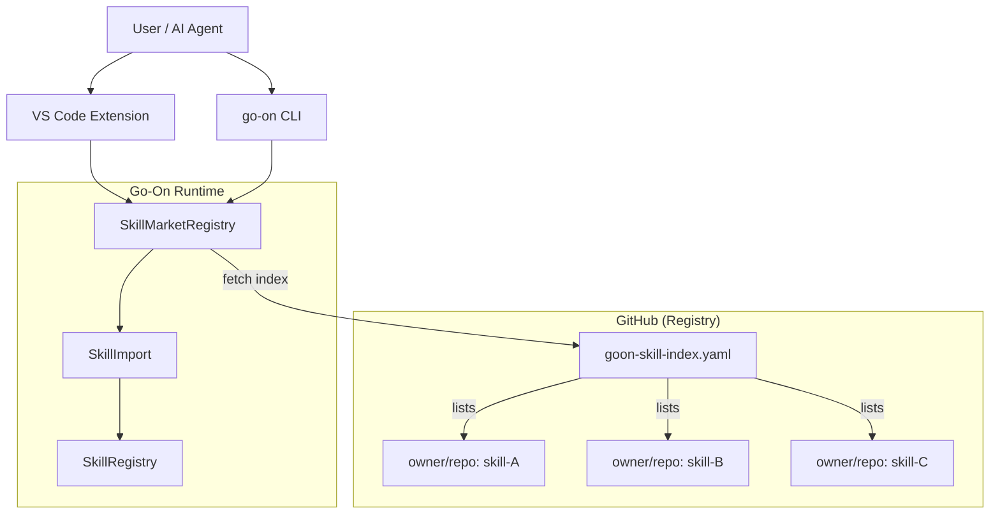

# Skill Marketplace — GitHub Community Plugin Ecosystem

## Status: Blueprint / Design Phase

## 1. Vision

Create a decentralized, GitHub-hosted skill marketplace where community members can publish, discover, and install Go-On skills without requiring a central registry server. The marketplace leverages:

- **GitHub as the registry**: Skills are stored in GitHub repositories, discovered via a well-known index file.
- **SKILL.md as the packaging format**: Each skill is a directory with a `SKILL.md` manifest (already supported).
- **`goon-skill-index.yaml` as the catalog**: A community-maintained index file that lists available skills.

## 2. Architecture



## 3. Index File Format

The community index is a single YAML file hosted at a well-known GitHub repository (e.g. `github.com/go-on/skills/goon-skill-index.yaml`).

```yaml
# goon-skill-index.yaml v1
schema_version: "1.0"
updated_at: "2026-06-29T00:00:00Z"
maintainers:
  - github: "mikewolfli"
skills:
  - name: "code-reviewer"
    description: "Automated code review with customizable rules"
    author: "go-on-contrib"
    repository: "github.com/go-on-contrib/skill-code-reviewer"
    path: "skills/code-reviewer"  # path within repo containing SKILL.md
    version: "1.2.0"
    min_go_on_version: "1.0.0"
    tags: ["code-review", "quality", "rust"]
    verified: true
    rating: 4.5
    install_count: 128

  - name: "db-query-assistant"
    description: "Natural language to SQL query assistant"
    author: "community-member"
    repository: "github.com/community/skill-db-assistant"
    path: "."
    version: "0.3.0"
    min_go_on_version: "1.1.0"
    tags: ["database", "sql", "nlp"]
    verified: false
```

## 4. Implementation Plan

### Phase 1: Index Fetching & Skill Discovery (2-3 days)

**Backend changes** (`src/orchestration/skill_market.rs`):

1. **`fetch_community_index()`** — Download and parse `goon-skill-index.yaml` from the canonical GitHub URL.
   ```rust
   pub async fn fetch_community_index(url: &str) -> Result<Vec<SkillMarketItem>>
   ```

2. **`search_marketplace()`** — Search the fetched index by name, tag, or description.
   ```rust
   pub fn search_marketplace(index: &[SkillMarketItem], query: &str) -> Vec<SkillMarketItem>
   ```

3. **`install_from_marketplace()`** — Clone or download a skill from its GitHub repository and import via `SkillImport`.
   ```rust
   pub async fn install_from_marketplace(
       registry: &SkillRegistry,
       item: &SkillMarketItem,
   ) -> Result<SkillInstallation>
   ```

**VS Code Extension**:

4. **`go-on.marketplaceBrowse`** — Command that opens a skill browser webview.
5. **`go-on.marketplaceInstall`** — Command to install a selected skill.

### Phase 2: Publishing Workflow (2-3 days)

1. **`go-on skill publish`** — CLI command:
   - Validates the local skill directory (SKILL.md must parse correctly).
   - Creates a GitHub release or PR to add the skill to the index.
   - Generates a `goon-skill-publish.yaml` manifest for PR submission.

2. **VS Code `go-on.publishSkill`** — GUI for the same workflow.

3. **Automated CI** — GitHub Action that validates submitted skills:
   - Parses SKILL.md ✓
   - Checks `min_go_on_version` compatibility
   - Runs basic smoke test

### Phase 3: Verification & Ratings (3-5 days)

1. **Verified badge** — Maintainer-reviewed skills get the `verified: true` flag.
2. **Install tracking** — Each installation increments a counter (stored locally, reported back optionally).
3. **Rating system** — Users can rate installed skills (1-5 stars, stored in local config).

## 5. Data Types (already defined in `skill_market.rs`)

The following types are already implemented in `src/orchestration/skill_market.rs`:

- `SkillSource` — GitHub, URL, Local, or Registry source
- `SkillMarketItem` — Full skill listing with metadata
- `SkillInstallation` — Installed skill record
- `SkillMarketRegistry` — Manages installation records
- `SkillMarketItemView` — Serializable display view
- `SkillMarketSearchQuery` — Structured search parameters
- `MarketplaceSearchResult` — Ranked search result

## 6. CLI Interface Design

```text
go-on skill market
  search <query>       Search the marketplace
  list                 List installed marketplace skills
  install <name>       Install a skill from the marketplace
  publish [path]       Publish a skill to the marketplace
  update <name>        Update an installed skill
  remove <name>        Remove an installed skill
  index refresh        Refresh the local index cache
  index status         Show index cache status
```

## 7. VS Code Commands

| Command | Title | Icon |
|---------|-------|------|
| `go-on.marketplaceBrowse` | Browse Skill Marketplace | `$(marketplace)` |
| `go-on.marketplaceInstall` | Install Marketplace Skill | `$(cloud-download)` |
| `go-on.marketplacePublish` | Publish Skill to Marketplace | `$(cloud-upload)` |
| `go-on.marketplaceUpdate` | Update Installed Skills | `$(sync)` |

## 8. Security Considerations

- **SHA-256 verification**: All downloaded skills must match their advertised hash.
- **Sandbox execution**: Skills run within the existing `SandboxLevel` governance model.
- **Scope limits**: Skills can declare `required_permissions` in their manifest; the import process warns if a skill requests more permissions than the current sandbox allows.
- **Review process**: Only `verified: true` skills have been reviewed by maintainers. Unverified skills display a warning before installation.

## 9. Open Questions

1. **Index hosting**: Should the canonical index be in the go-on/skills repo or a separate org?
   - **Recommendation**: `github.com/go-on/skills` — easy to find, one PR to add a skill.
2. **Install tracking**: Anonymous telemetry or fully offline?
   - **Recommendation**: Fully offline first. Install counts can be updated manually by skill authors.
3. **Verified badge**: Manual review by core maintainers or automated CI checks?
   - **Recommendation**: Manual review for `verified: true`. Automated CI for basic validation (parse check, version check).

## 10. Dependencies

- `reqwest` (already a dependency) — for fetching the index and downloading skills
- `serde_yaml` (already a dependency under `data-export` feature) — for parsing the YAML index
- `sha2` (already a dependency) — for SHA-256 verification
- Git CLI (already used by `git` tool) — for cloning skill repositories

No new external dependencies are required.
