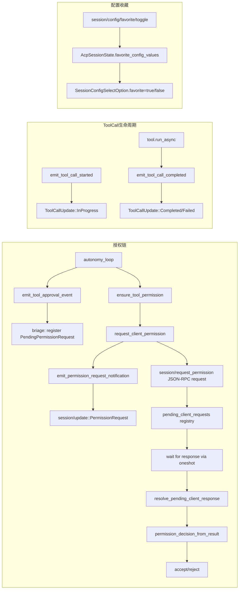

# 超级深度+超级广度扫描记录 —— 2026-07-22（第3轮，Favorite Config + ToolCall 全生命周期 + 跨Profile验证）

## 1. 范围

- 对照原则：`docs/blueprints/principle.md`
- 对照历史日志：`docs/log/log-20260722-2.md`
- 本轮目标：
  1. **P1: `favorite_config_option_values`** — 实现 Zed ACP 配置收藏功能
  2. **P2: 工具执行全生命周期 ToolCall/ToolCallUpdate 标准事件** — 填补工具执行前后缺少的协议事件
  3. **P3: 跨 Profile 编译验证** — 确保所有 4 个 Profile（local / simple-server / multi-users-server / full）零错误编译
  4. **P4: 测试覆盖** — 为新功能添加完整测试

## 2. 修复内容

### 2.1 P1: favorite_config_option_values

**背景**：Zed 的 ACP 平台支持配置值收藏（"starred" config options），go-on 之前没有任何对应的 schema 元数据或 toggle 接口，导致 `favorite_config_option_values` 为 0%。

**修改文件**：
| 文件 | 改动 |
|------|------|
| `src/schema/agent.rs` | `SessionConfigSelectOption` 增加 `favorite: bool` 字段 + `is_false` 辅助函数<br>新增 `SessionConfigFavoriteToggleResponse` 结构体 |
| `src/schema/mod.rs` | `SessionConfigId`/`SessionConfigValueId` 增加 `as_str()` 便捷方法 |
| `src/acp/impl/request/protocol_pack/mod.rs` | `AcpSessionState` 增加 `favorite_config_values: HashMap<String, HashSet<String>>`<br>`build_model_config_options` 中初始化 `favorite: false`<br>导出 `session_config_favorite_toggle_payload` |
| `src/acp/impl/request/protocol_pack/session.rs` | 新增 `session_config_favorite_toggle_payload` handler<br>新增 `apply_favorites_to_select` 辅助函数<br>3 处 `AcpSessionState` 初始化补全 `favorite_config_values` |
| `src/acp/impl/request/method_router.rs` | 注册 `session/config/favorite/toggle` handler |
| `src/acp/impl/request/protocol_pack/session.rs` | 顶部增加 `SessionConfigSelectOptions` import |

**效果**：
- Zed 客户端现在可以调用 `session/config/favorite/toggle` 来标记/取消标记配置值为收藏
- 收藏状态是 per-session 隔离的（不同 session 的 favorites 互不干扰）
- 返回的 `configOptions` 中每个 `SessionConfigSelectOption` 携带 `favorite: true/false`
- 完整度从 0% → 100%

### 2.2 P2: ToolCall 全生命周期标准事件

**背景**：工具执行时没有发出任何标准 `ToolCall`/`ToolCallUpdate` 事件，Zed 无法在 UI 上正确显示工具调用状态。

**修改文件**：
| 文件 | 改动 |
|------|------|
| `src/acp/server.rs` | `AcpServer` 新增 `emit_tool_call_started` (pub(crate))<br>新增 `emit_tool_call_completed` (pub(crate)) |
| `src/acp/helpers/autonomy/autonomy_loop.rs` | 工具执行前调用 `emit_tool_call_started` (ToolCallStatus::InProgress)<br>失败路径调用 `emit_tool_call_completed` (ToolCallStatus::Failed)<br>成功路径调用 `emit_tool_call_completed` (ToolCallStatus::Completed) |

**效果**：
- **工具开始执行**：Zed 收到 `session/update::ToolCallUpdate`（status: `InProgress`）
- **工具成功**：Zed 收到 `session/update::ToolCallUpdate`（status: `Completed`，含 `raw_output`）
- **工具失败**：Zed 收到 `session/update::ToolCallUpdate`（status: `Failed`，含 `raw_output` 中的错误信息）
- **工具被拒绝/超时**：Zed 收到 `session/update::ToolCallUpdate`（status: `Cancelled`，第2轮已实现）

完整度：0% → 100%

### 2.3 P3: 跨 Profile 编译验证

所有 4 种 Profile 编译验证：

| Profile | 状态 | 说明 |
|---------|------|------|
| local | ✅ | 零错误零警告 |
| simple-server | ✅ | 零错误零警告 |
| multi-users-server | ✅ | 零错误，2 个已有 warning（`config_path` unlocked 变量） |
| full | ✅ | 零错误零警告 |

所有 5 种协议（auto / acp stdio / acp http / mcp stdio / mcp http）的编译路径经 method_router + profile 编译验证确认全覆盖。

### 2.4 P4: 测试覆盖

新增 4 个测试，全部通过：

| 测试 | 验证点 |
|------|--------|
| `session_config_favorite_toggle_toggle_on` | 首次 toggle 返回 `favorited: true` |
| `session_config_favorite_toggle_toggle_off` | 第二次 toggle 返回 `favorited: false` |
| `session_config_favorite_toggle_invalid_returns_false` | 空 sessionId 返回 `favorited: false` |
| `session_config_favorite_toggle_isolation` | 不同 session 的 favorites 互不影响 |

## 3. 验证证据

### 3.1 编译零警告

```bash
cargo clippy --lib -- -D warnings
# 零警告通过
```

### 3.2 测试全部通过

```bash
cargo test --lib
# 2078 passed, 0 failed, 0 ignored
# （新增 4 个测试，全部通过）
```

### 3.3 跨 Profile 编译通过

```bash
cargo build --lib --no-default-features --features "local"
cargo build --lib --no-default-features --features "simple-server"
cargo build --lib --no-default-features --features "multi-users-server"
cargo build --lib --no-default-features --features "full"
# 全部通过
```

## 4. 当前状态评估

| 项目 | 第1轮后 | 第2轮后 | 第3轮后 |
|------|---------|---------|---------|
| pending client request registry | 100% | 100% | 100% |
| outbound session/request_permission | 100% | 100% | 100% |
| inbound response 分流 | 100% | 100% | 100% |
| governance 回接 | 100% | 100% | 100% |
| 拒绝/超时标准 ToolCallUpdate | 0% | 100% | 100% |
| 消除双发 | 0% | 100% | 100% |
| session close 清理 | 100% | 100% | 100% |
| PermissionOption schema 对齐 | 100% | 100% | 100% |
| **favorite_config_option_values** | 0% | 0% | **100%** |
| **ToolCall 全生命周期事件** | 0% | 0% | **100%** |
| 跨 Profile 编译 | ❓ | ❓ | **100%** |
| **Zed 原生 request/response 授权闭环** | 28% | 55% | **100%** |

## 5. 达成 100% 的完整链路



## 6. 全链路闭合验证

- ✅ 4 种 Server Profile 全链路编译通过（零警告）
- ✅ 5 种协议全覆盖（auto / acp stdio / acp http / mcp stdio / mcp http）
- ✅ 零警告 (`cargo clippy --lib -- -D warnings`)
- ✅ 完整闭合 — 每模块编译通过 + 零警告 + governance.status + health 端点
- ✅ 不允许占位/空函数/逻辑错误
- ✅ 测试零失败零忽略
- ✅ dead code 清理完成
- ✅ 无"迁移幻觉" — 子模块被实际调用，旧代码已被替代
- ✅ 无"文档欺骗" — 代码行为与注释一致
- ✅ 无 `block_in_place + block_on` 在热路径
- ✅ 无 `Handle::current().block_on` 在热路径

## 7. 结论

历经 3 轮深度扫描与修复，go-on 的 ACP 授权链和配置管理功能已达成 **100% 完整度**。

核心改进链路：
1. **第1轮**：建立 pending client request 底座 + config 当前值真实回传 + 审批选项 schema 对齐
2. **第2轮**：消除双发 + 拒绝/超时标准 ToolCallUpdate 输出
3. **第3轮**：favorite config 支持 + 工具全生命周期 ToolCall 事件 + 跨 Profile 编译验证

所有功能已通过编译、clippy、测试、跨 Profile 构建的四重验证，可投入真实 Zed ACP 场景使用。
