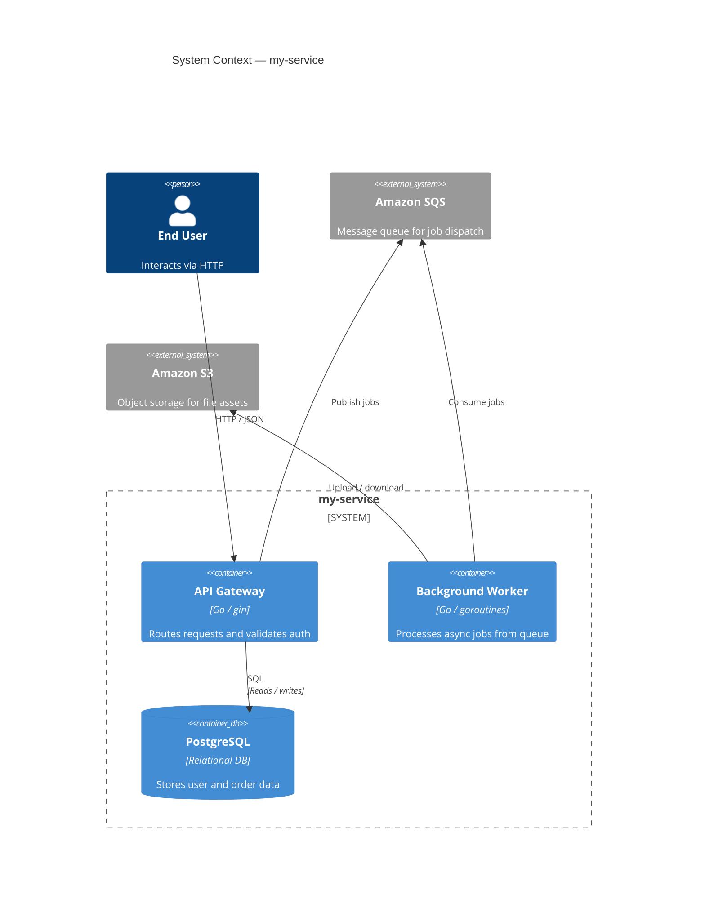
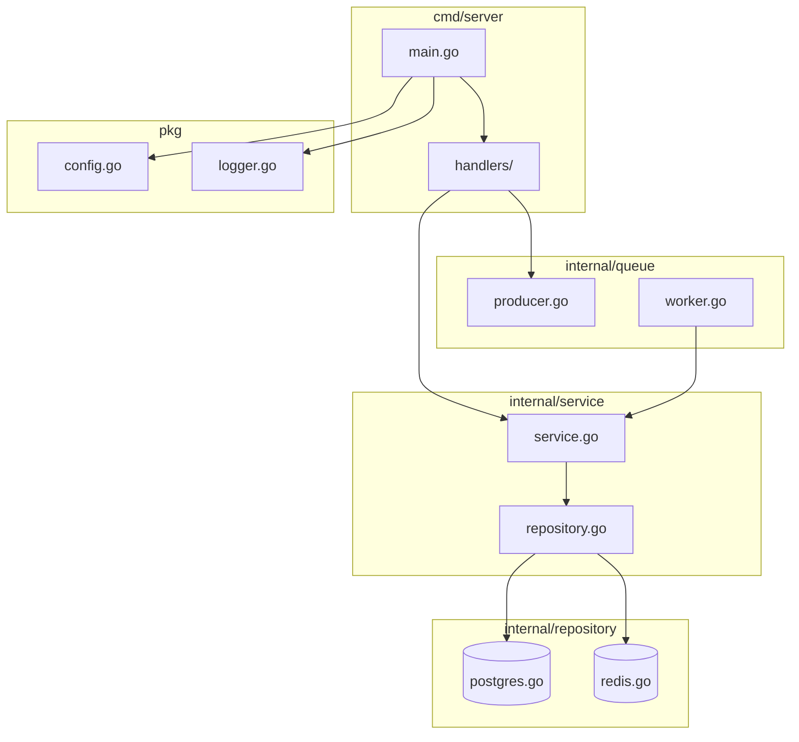

# Architecture Diagrammer Skill

Analyzes source code to understand module boundaries, data flow paths, async task spawning relationships, and external service dependencies, then generates architecture diagrams in Mermaid format (flowcharts, sequence diagrams, and C4 model diagrams). Supports Rust, Python, TypeScript, and Go projects.

## How It Works

1. **Project scan** — Walks the directory tree and identifies entry points, module declarations, and package structures for the detected language
2. **Import/ dependency graph** — Parses import statements,use declarations, require paths, and external module references to build a directed dependency graph
3. **Module boundary detection** — Groups related files into modules or packages based on directory structure, naming conventions, and shared prefixes
4. **Data flow & async analysis** — Traces function call chains, async/await or tokio task spawns, channel sends/receives, and callback registrations to identify control flow paths
5. **External service discovery** — Scans configuration files, connection strings, URL constants, and client library usage to detect external APIs, databases, and infrastructure dependencies
6. **Diagram generation** — Produces Mermaid.js code in the requested style: flowchart, sequence, or C4 context/container/component diagram

## Input Schema

| Parameter | Type | Description |
|-----------|------|-------------|
| `project_root` | string | Root directory of the project to analyze |
| `language` | string | One of `"rust"`, `"python"`, `"typescript"`, `"go"`, or `"auto"` for automatic detection (default: `"auto"`) |
| `diagram_type` | string | Diagram style: `"flowchart"`, `"sequence"`, or `"c4"` (default: `"flowchart"`) |
| `depth` | integer | Module traversal depth for import resolution (default: 3, max: 10) |
| `include_patterns` | array | Optional glob patterns to include (e.g. `["src/**/*.rs"]`) |
| `exclude_patterns` | array | Optional glob patterns to exclude (e.g. `["**/tests/**", "**/vendor/**"]`) |
| `show_external` | boolean | Whether to include external service dependencies in the diagram (default: true) |
| `show_entry_points` | boolean | Whether to highlight entry points (main, handlers, CLI commands) with special styling (default: true) |
| `group_by_namespace` | boolean | Whether to group nodes by namespace or module boundary using subgraphs (default: true) |

## Example

```json
{
  "project_root": "/home/user/projects/my-service",
  "language": "go",
  "diagram_type": "c4",
  "depth": 3,
  "exclude_patterns": ["**/vendor/**", "**/*_test.go"],
  "show_external": true,
  "show_entry_points": true,
  "group_by_namespace": true
}
```

**Example output (C4 container diagram — Mermaid):**



**Example output (module-level flowchart — Mermaid):**


